# google-cloud-security-handson

# google cloud上の組織のつくりかた

- https://cloud.google.com/resource-manager/docs/creating-managing-organization?hl=ja
- google workspaceを使えるようにする必要がある
- https://workspace.google.com/individual/
    - ちょっとお金が掛かるのでやめておくことにする

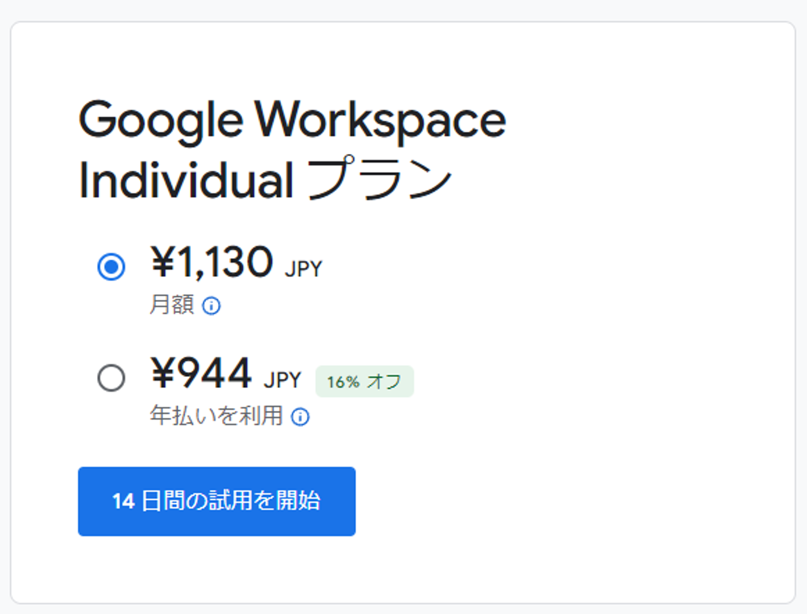

# google cloud projectをつくる

- gc-security-handsonプロジェクトをつくった

```python
gcloud auth login
gcloud config set project gc-security-handson
gcloud auth application-default login
gcloud config list
```

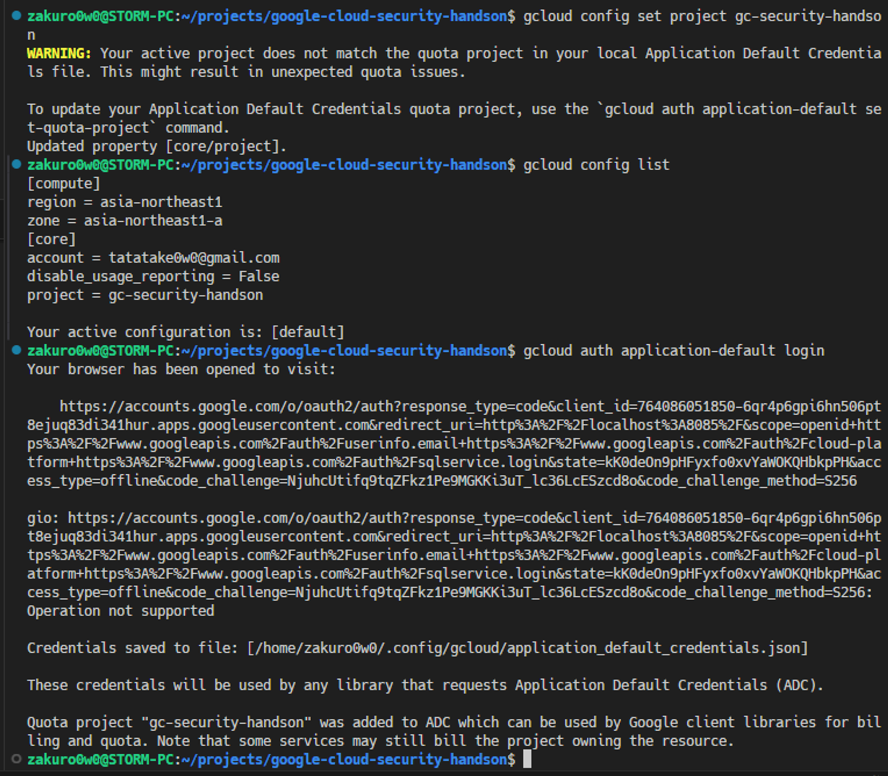

# terraform setup

- tfenvをインストール
- main.tfを用意

```python
provider "google" {
  project     = "gc-security-handson"
  region      = "asia-northeast1"
}
```

```python
terraform init
terraform plan
terraform apply
```

# google cloudのユーザとサービスアカウント

- あるユーザに与えたIAMロールが正しく機能しているかをgoogle cloudコンソール上で確認したい
- サービスアカウントを新規に作り、最小権限を与えた上で、サービスアカウントになりすますことができればOKでは？
    - これはできなかった、サービスアカウントへのなりすましは不可
- 別途ユーザを作る必要がありそうだが、メールアドレスの実態が必要
    - また、gmailのエイリアスでは別アドレスと認識されないので本当にgmailアドレスを新規作成しなければならない(面倒)
    - AWS IAMユーザのようにメールアドレスの実態を持たない仮想的なユーザを作ることはできない
- となると、コンソール上での権限の振る舞い確認を諦めてターミナルでのCLIベースで権限を確認するしか無い？
    - この場合はサービスアカウントの鍵を発行し、鍵で認証したCLIでのアクセスを試みる必要がある(これも少し面倒)

# サービスアカウントとして振る舞う

- 鍵を作る

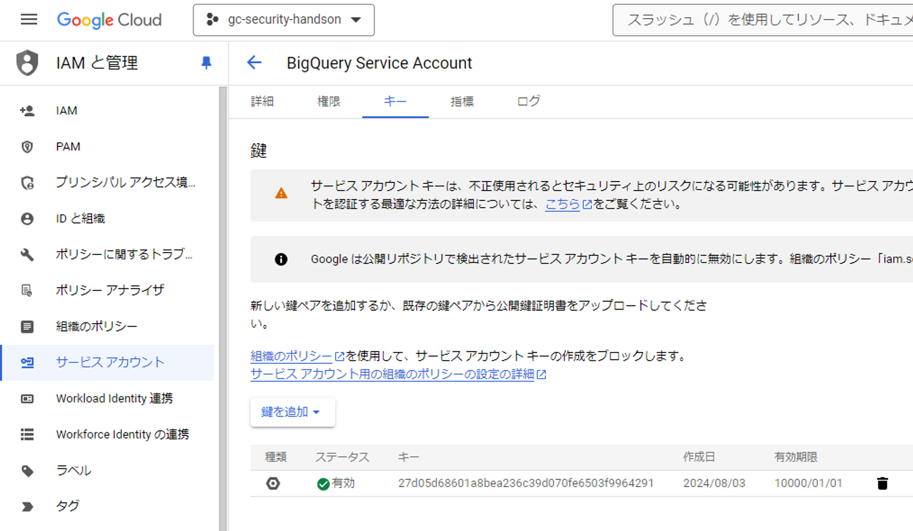

- ダウンロードした鍵を使ってサービスアカウントとして認証

```python
gcloud auth activate-service-account --key-file=./service_account_key/gc-security-handson-27d05d68601a.json
```

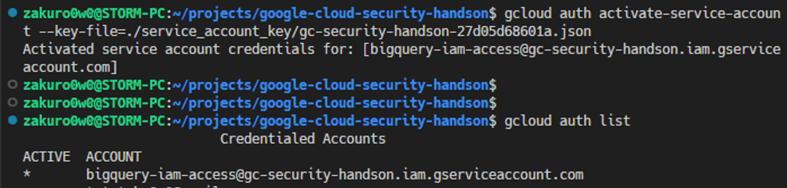

- CLIでBigQueryにアクセスする

```python
bq ls
bq ls dataset_A
bq show dataset_A.table_B
bq query "SELECT * FROM gc-security-handson.dataset_A.table_B"
```

- showまではできたがクエリの実行では`bigquery.jobs.create` 権限が不足していてNGだった

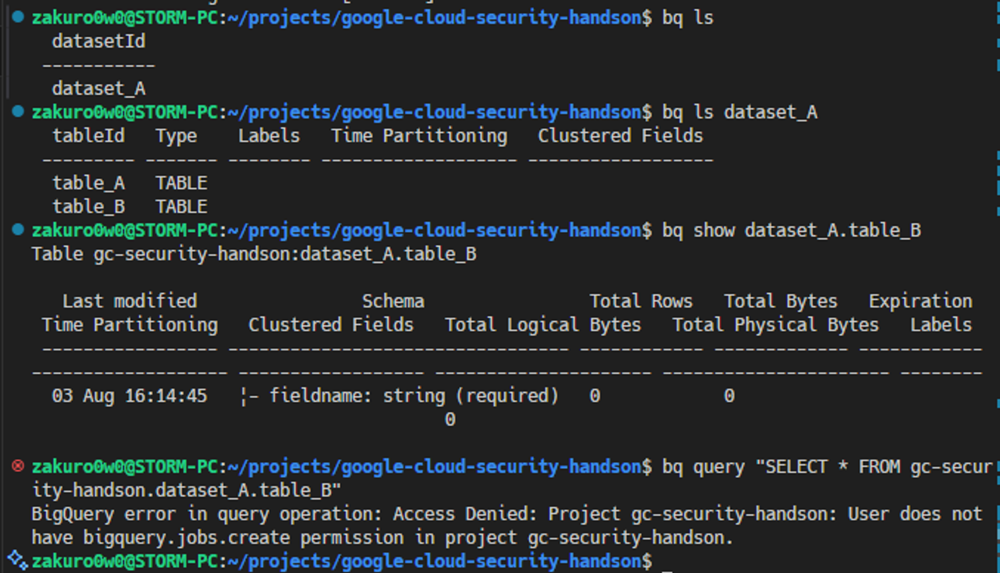

# データセット単位のアクセス制御

- データセットA、Bの2つを用意し、片方のデータセットだけ閲覧できるようにする

```jsx
resource "google_service_account" "service_account" {
  account_id   = "bigquery-iam-access"
  display_name = "BigQuery Service Account"
}

# memberに指定したプリンシパルに特定のデータセットに限定したroleを与える
resource "google_bigquery_dataset_iam_member" "dataset_A_access" {
  project = data.google_project.current.project_id
  dataset_id = google_bigquery_dataset.dataset_A.dataset_id
  role = "roles/bigquery.dataViewer"
  member = "serviceAccount:${google_service_account.service_account.email}"
}
```

- データセットの権限を確認
    - データセットAに対してはBigQueryデータ閲覧者の権限がサービスアカウントに付与されている

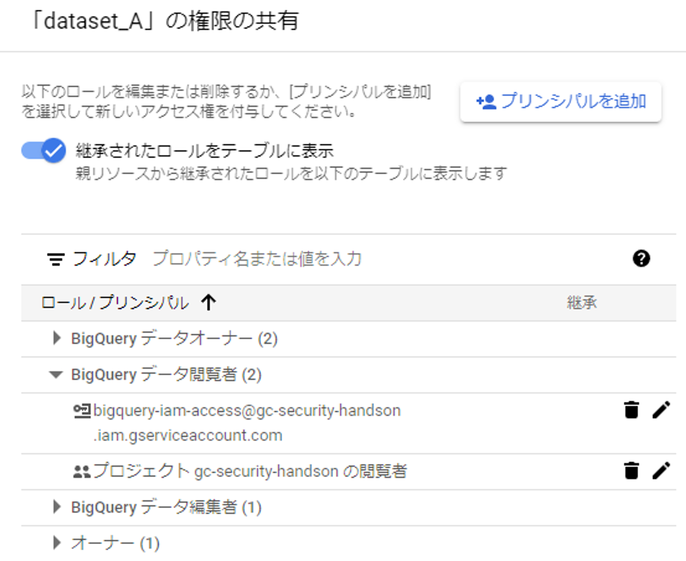

- データセットBに対してはデータ閲覧者権限が与えられていないことが確認できた

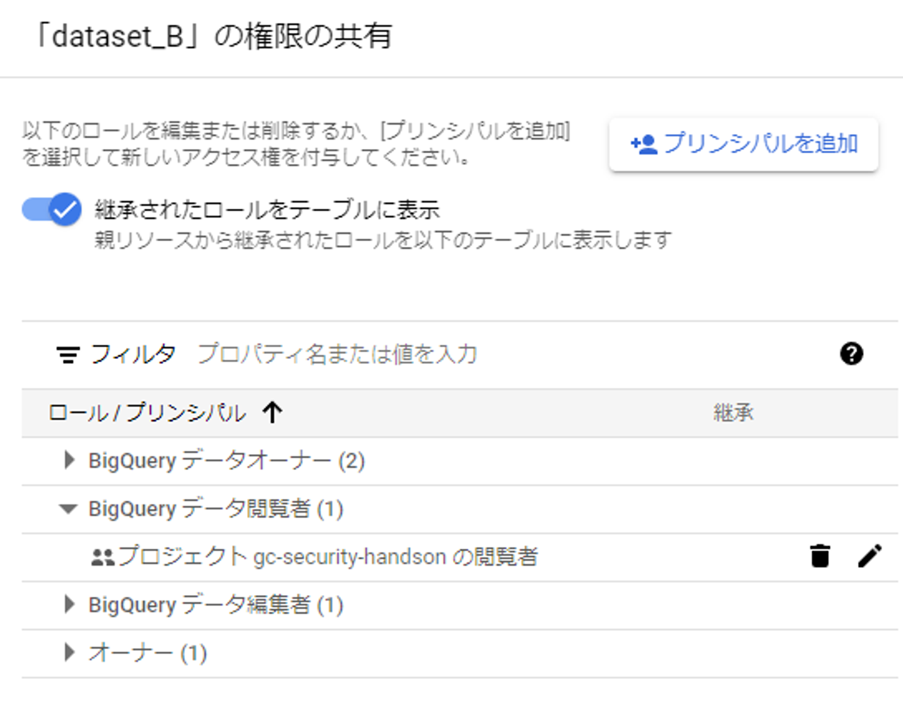

- サービスアカウントの鍵で認証した後、CLIでBigQueryにアクセスしてみる
- データセットAについては閲覧者権限によって色々閲覧できることを確認
- データセットBについては閲覧者権限が無いのでlsで一覧に表示されず、直接名前を指定した場合にはPermissionエラーが表示されると確認できた

```jsx
bq ls
bq ls dataset_A
bq show dataset_A.table_B
bq ls dataset_B
```

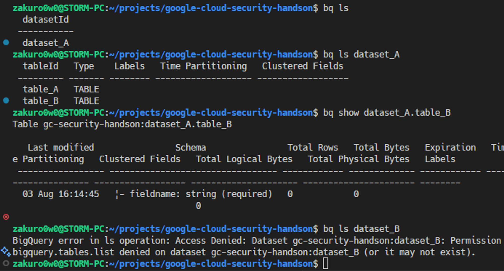

# BQテーブル単位のアクセス制御

- データセットAのテーブルAだけが見えるようにする

```jsx
resource "google_service_account" "service_account" {
  account_id   = "bigquery-iam-access"
  display_name = "BigQuery Service Account"
}

resource "google_bigquery_table_iam_member" "dataset_A_table_A_access" {
  project = data.google_project.current.project_id
  dataset_id = google_bigquery_dataset.dataset_A.dataset_id
  table_id = google_bigquery_table.table_A.table_id
  role = "roles/bigquery.dataViewer"
  member = "serviceAccount:${google_service_account.service_account.email}"
}
```

- データセットの閲覧者にはサービスアカウントは並んでいない

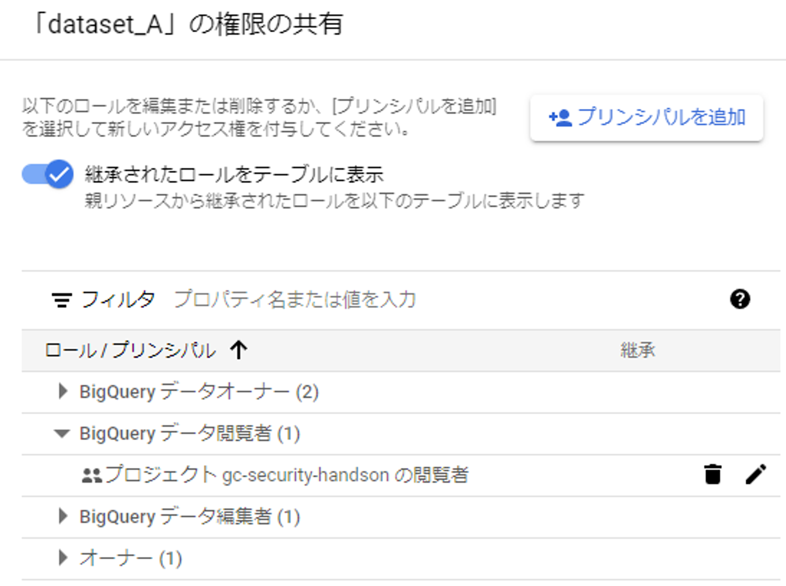

- テーブルの閲覧者にサービスアカウントが並んでいることを確認できた

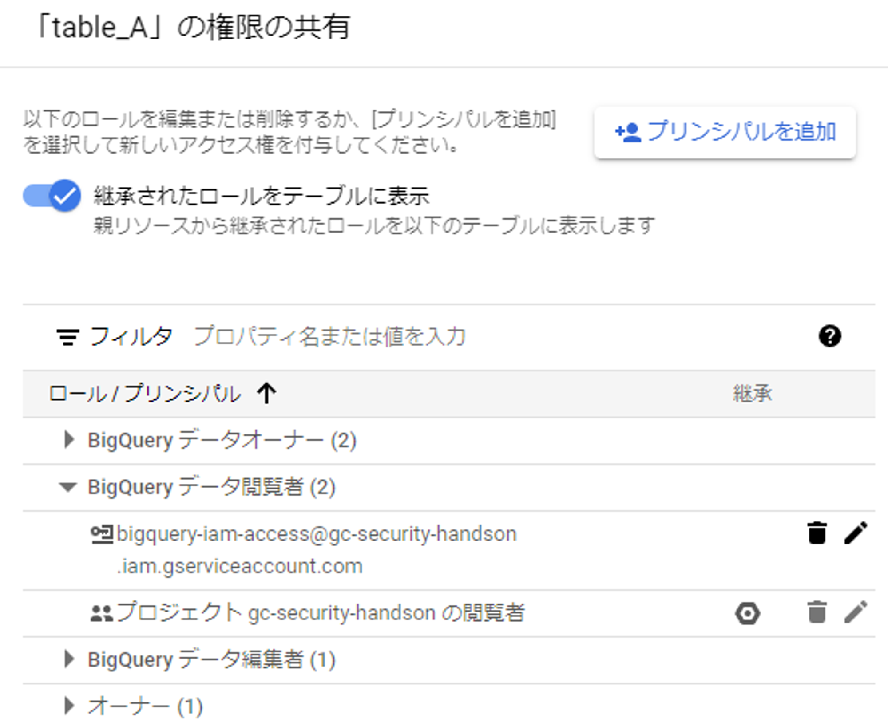

```jsx
bq ls
bq ls dataset_A
bq show dataset_A.table_A
```

- `bq ls` ではデータセット自体が表示されなかった
- `bq show` でテーブルまで指定してようやく表示された

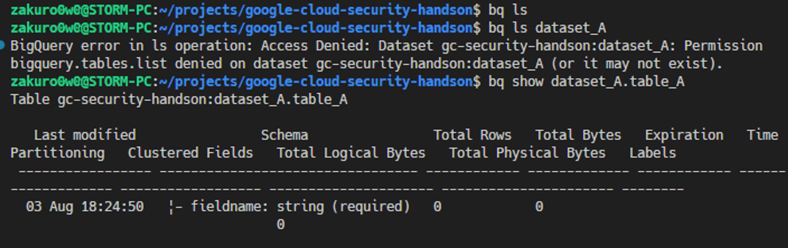

# カラム単位のアクセス制御

- 参考記事
    - https://cloud.google.com/bigquery/docs/column-level-security-intro?hl=ja
    - https://zenn.dev/nedoko_dok0dko/articles/bc6a413eb623c7
    - https://www.yasuhisay.info/entry/2023/08/19/100000
    - https://techblog.zozo.com/entry/policy-tag-usage-to-protect-bigquery-sensitive-data
- 以下のterraformコードでポリシータグを作る

```jsx
resource "google_data_catalog_taxonomy" "basic_taxonomy" {
  region       = "asia-northeast1"
  display_name = "basic_taxonomy"
  description  = "A collection of policy tags"

  # 管理者であっても権限付与を明示的に行なわないと見れなくなる
  # SELECT *している場合は権限がなくなるので注意が必要
  activated_policy_types = ["FINE_GRAINED_ACCESS_CONTROL"]
}

resource "google_data_catalog_policy_tag" "parent_policy_tag" {
  taxonomy     = google_data_catalog_taxonomy.basic_taxonomy.id
  display_name = "親のポリシータグ"
  description  = "親のポリシータグです"
}

resource "google_data_catalog_policy_tag" "child_policy_tag" {
  taxonomy          = google_data_catalog_taxonomy.basic_taxonomy.id
  display_name      = "子どものポリシータグ"
  description       = "子どものポリシータグです"
  parent_policy_tag = google_data_catalog_policy_tag.parent_policy_tag.name
}
```

- DataCatalogのリソースに見えるがポリシータグは`BigQuery → 管理` 配下にある
    - DataCatalogやIAM配下を探し回って見つからなかったので時間が掛かった

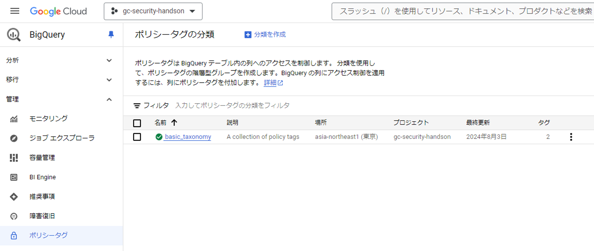

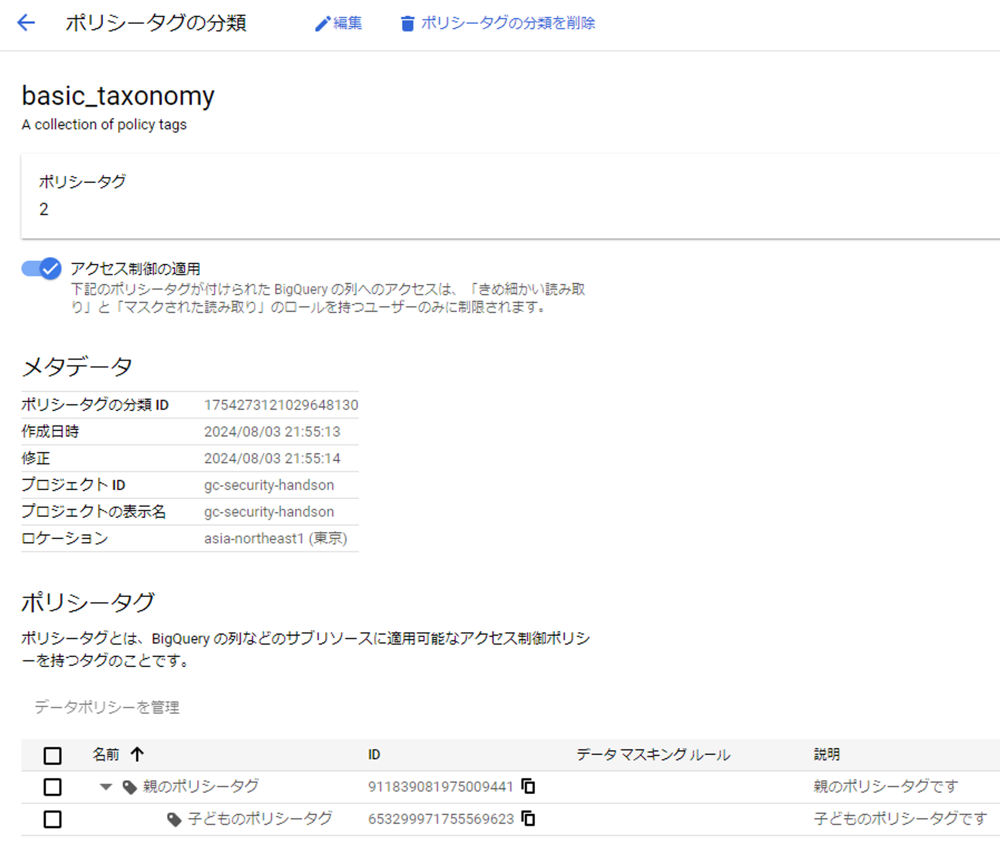

## BigQurey Data Policy

- 以下のようなコードでデータマスキングできる模様
- プロジェクトが組織に参加していないと使えないリソースらしいので実際にはapplyできなかった

```jsx
# BigQuery Data Policyのサンプルコード
# https://registry.terraform.io/providers/hashicorp/google/latest/docs/resources/bigquery_datapolicy_data_policy#example-usage---bigquery-datapolicy-data-policy-routine
# data_masking_policyにBQリモート関数を指定し、関数の実装で機密データをマスキングすると思われる
# google cloudプロジェクト自体が組織に参加していないとこのリソースは作成できない模様(以下のエラーが出てしまう)
# Error creating DataPolicy: googleapi: Error 400: The project **** needs to belong to an organization to manage DataPolicies.
resource "google_bigquery_datapolicy_data_policy" "data_masking_policy" {
  location         = "asia-northeast1"
  data_policy_id   = "data_masking_policy"
  policy_tag       = google_data_catalog_policy_tag.child_policy_tag.name
  data_policy_type = "DATA_MASKING_POLICY"  
  data_masking_policy {
    routine = google_bigquery_routine.custom_masking_routine.id
  }
}

# passwordデータを"X"でマスキングするBQリモート関数
resource "google_bigquery_routine" "custom_masking_routine" {
    dataset_id           = google_bigquery_dataset.dataset_A.dataset_id
    routine_id           = "custom_masking_routine"
    routine_type         = "SCALAR_FUNCTION"
    language             = "SQL"
    data_governance_type = "DATA_MASKING"
    definition_body      = "SAFE.REGEXP_REPLACE(password, '[0-9]', 'X')"
    return_type          = "{\"typeKind\" :  \"STRING\"}"
    arguments {
      name = "password"
      data_type = "{\"typeKind\" :  \"STRING\"}"
    } 
}
```

## ポリシータグをテーブルのカラムに紐づける

- terraformのgoogle providerで実現する方法を探したが見つけられず…
- dbtで構築するテーブルやビューのカラムにポリシータグを紐づける方法はあった
    - https://www.yasuhisay.info/entry/2023/08/19/100000
- ひとまず既存のテーブルのカラムにポリシータグを紐つけた際の動作を確認したいので、google cloudコンソール上で操作する
- BiqQuery → データセット → テーブル → スキーマ → `スキーマの編集`

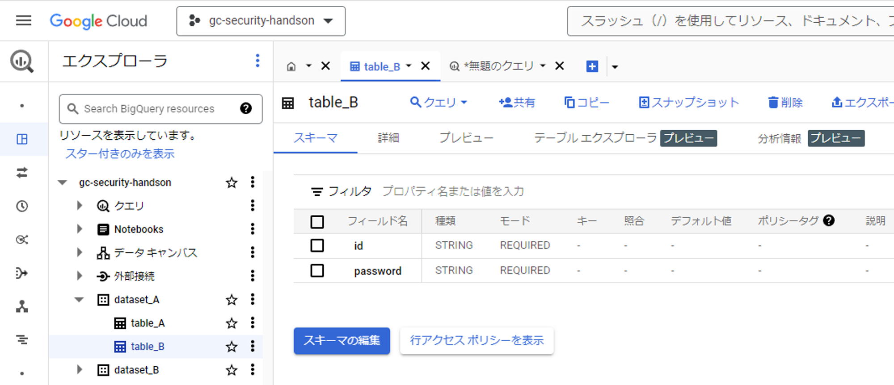

- ポリシータグを追加したいカラムを1つ選択 → `ADD POLICY TAG`

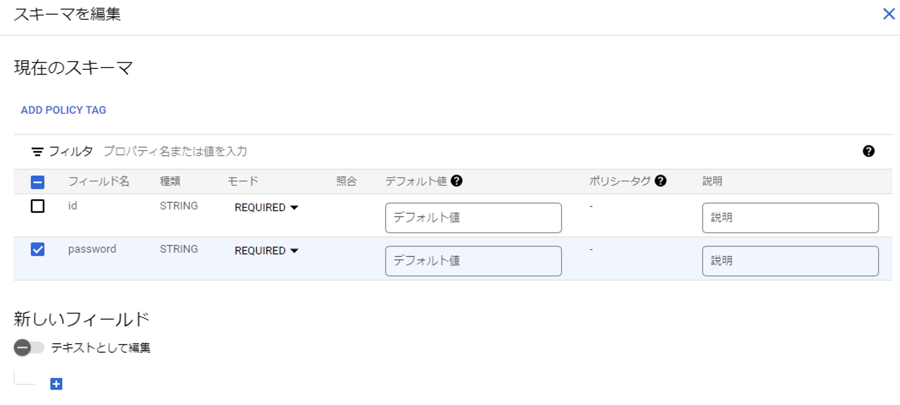

- 紐づけたいポリシータグを1つ選択

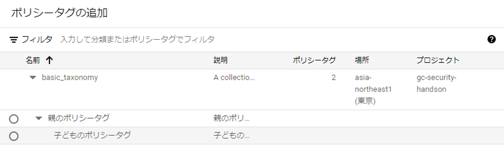

- カラムに対してポリシータグを追加できた

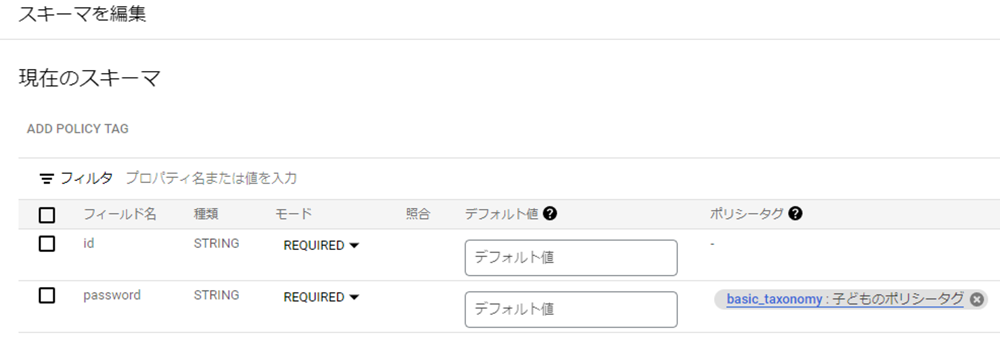

- ポリシータグによってカラムへのアクセスが制限されていることがわかる

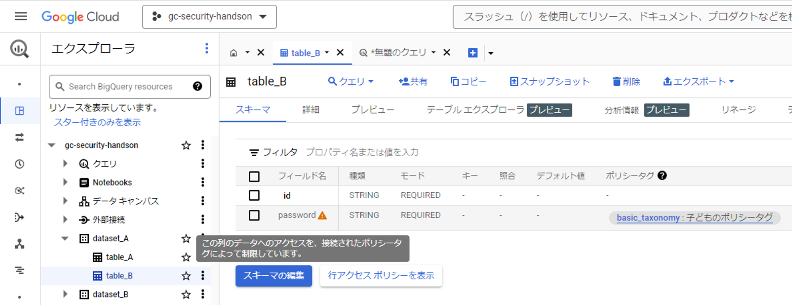

- プレビューを確認するとポリシータグを紐づけたカラムは非表示になっていた

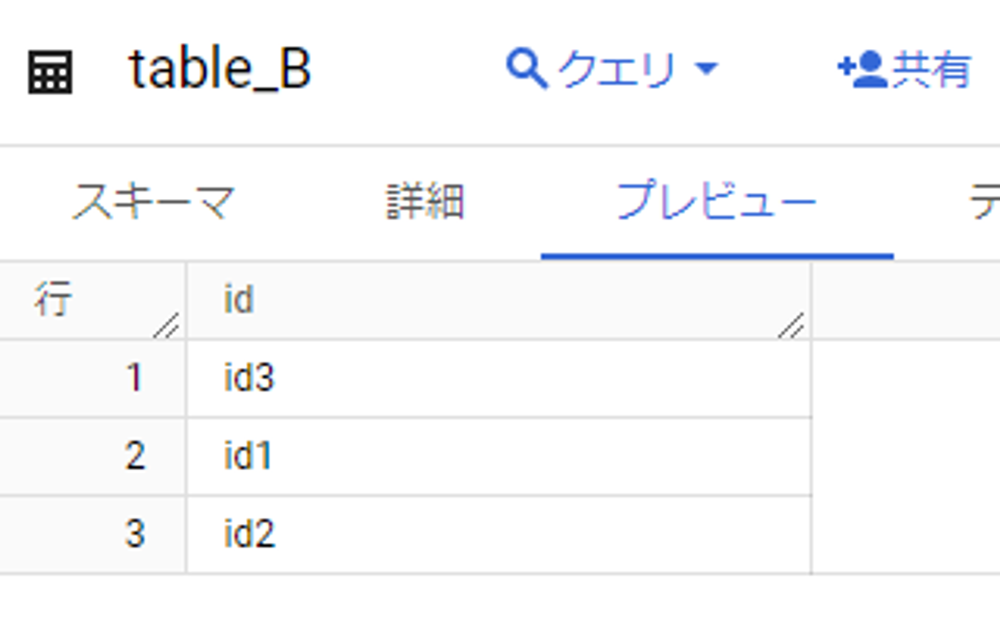

- `SELECT * FROM` のクエリを実行するとポリシータグによる制限でエラーになったことがわかる
    - オーナー権限のユーザでもこうなる

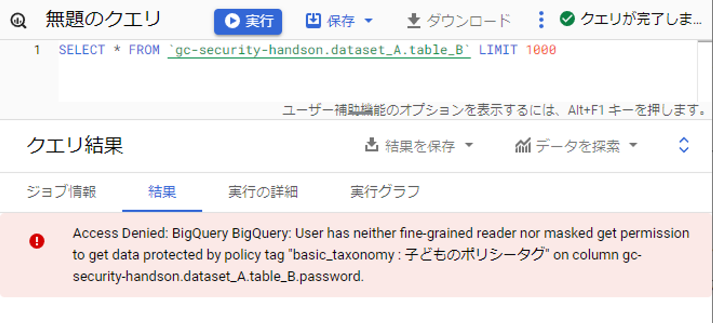

- 以下のように`EXCEPT({カラム名})` でSELECT対象から除外すれば閲覧制限されていないカラムをSELECTできる

```sql
SELECT * EXCEPT(password) FROM `gc-security-handson.dataset_A.table_B` LIMIT 1000
```

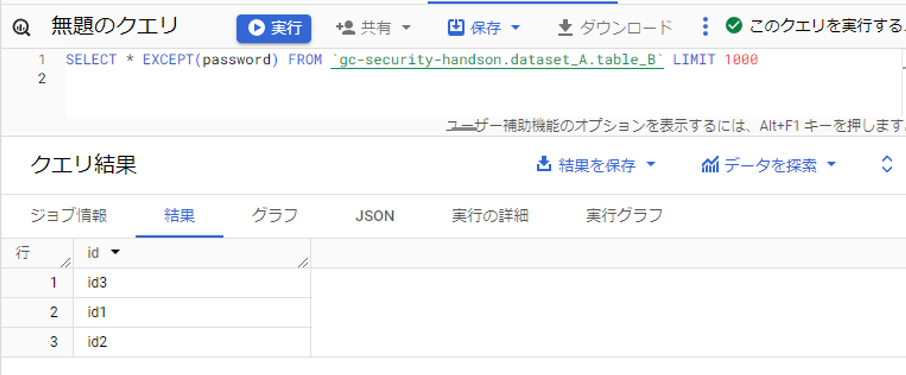

- ポリシータグと紐づけたカラムのデータ閲覧には`データカタログ/きめ細かい読み取り` の権限が必要
    - terraformでコードを書く場合は`roles/DataCatalog.categoryFineGrainedReader`

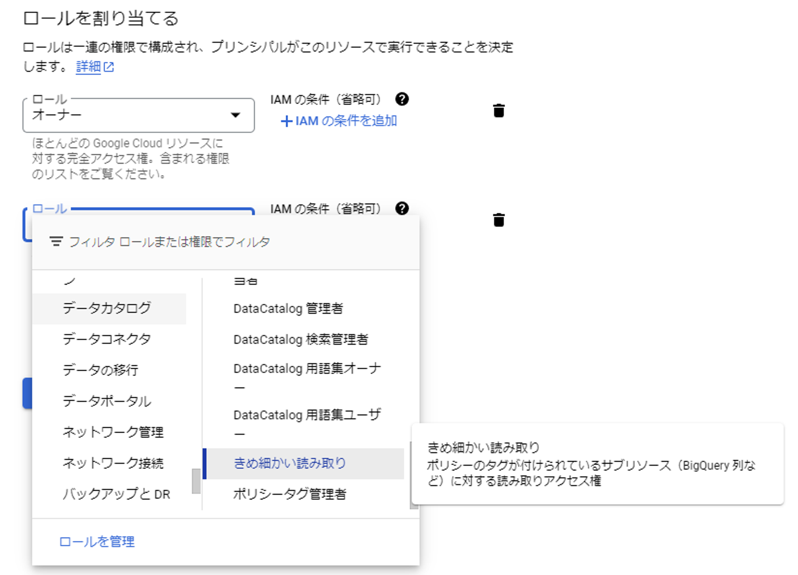

- 先の権限があれば以下のように制限無く閲覧可能になる

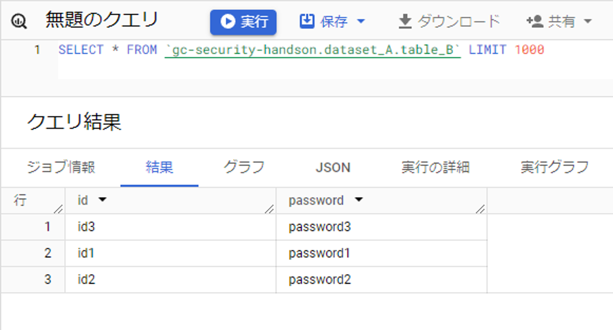

# まとめ

- 7.10まである章の7.3で力尽きてしまった
    - 書籍で紹介されていることをterraformで再現しながらやった結果…
    - VPCによるアクセス制御、Cloud Loggingによる監査、アクセス管理とコスト管理設計など
- 今回のハンズオンではBigQueryに対するIAMを使ったアクセス制御をterraformコードで実現し、実際にアクセスが制限されていることを確認した
    - プロジェクト単位、データセット単位、テーブル単位、カラム単位という異なる粒度でのアクセス制御ができた
    - カラム単位の制御に関してはterraformコードで実現する手段が見つけられなかった
    - 制限されていることをgoogle cloudコンソール上で確認しようとした場合、メールアドレスの実態が別途新規に必要となってしまう点が煩わしかった
        - AWS IAMユーザのようにメールアドレス無しではgoogle cloudユーザを作成できない
        - サービスアカウントは作成できるが、コンソール上でサービスアカウントになりすますことはできない
    - 今回はサービスアカウントにIAMでのアクセス制御を施した上で、鍵を使ってサービスアカウントとして振る舞うCLIでの動作確認を行った
- dbtでデータマートを作る際、マートのテーブルやビューに対してカラム単位でのポリシータグ付与が可能であることもわかった
    - dbtは既に存在するデータセットを使って新たなテーブルやビューを作るツールであることを再認識できた(何も無い所からテーブルの新規作成やデータ挿入をするためのツールではない)
        - 途中まで勘違いしており、dbtのSQLで`CREATE` しようとしていた